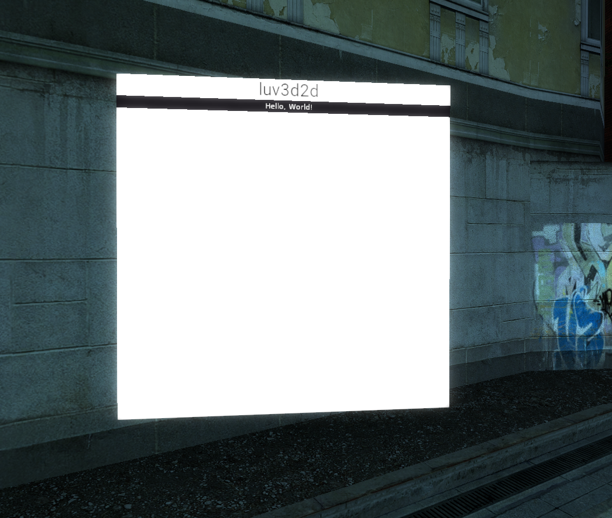

<h1 align="center">luv3d2d 🎨</h1>

<p align="center">
  A Garry's Mod addon for creating 3D2D canvases with ease.
</p>

## Table of Contents

- [Table of Contents](#table-of-contents)
- [Features ✨](#features-)
- [Usage 📚](#usage-)
- [Roadmap 🛣️](#roadmap-️)
- [License 📄](#license-)

## Features ✨

- Create 3D2D canvases with customizable dimensions and scale.
- Attach canvases to entities or specific positions.
- Use focus system for interactive canvases.

## Usage 📚

```lua
-- Example 1: Creating a basic canvas
local canvas = luv3d2d:CreateCanvas(Vector(0, 0, 0), Angle(0, 0, 0), 100, 100)

-- Example 2: Creating a canvas attached to an entity
local entity = Entity(1)
local canvas = luv3d2d:CreateCanvas(entity, Angle(0, 0, 0), 200, 200, 0.5, true)
```

For more detailed examples, check out the examples directory.


## Roadmap 🛣️

- [ ] Improve performance and optimization.
- [ ] Improve focus system.
- [ ] Add dev tool for easier canvas creation and attachment to entities.
- [ ] Add more examples and documentation.
- [ ] Implement additional features based on user feedback.

## License 📄

This project is licensed under the MIT License. See the [LICENSE](./LICENSE) file for details.
